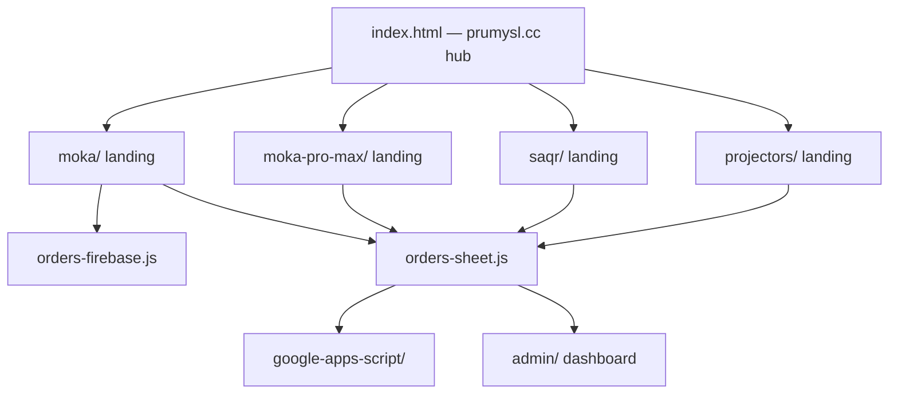

# Prumysl site architecture

**tldraw:** Open the tldraw panel in Cursor, then run `docs/tldraw-architecture.js` via the tldraw **exec** MCP tool (canvas must be visible — otherwise exec times out).

**SVG fallback:** See [architecture.svg](./architecture.svg).

Product landings share `css/brand.css`, `js/scroll-reveal.js`, and order backends configured per product.
